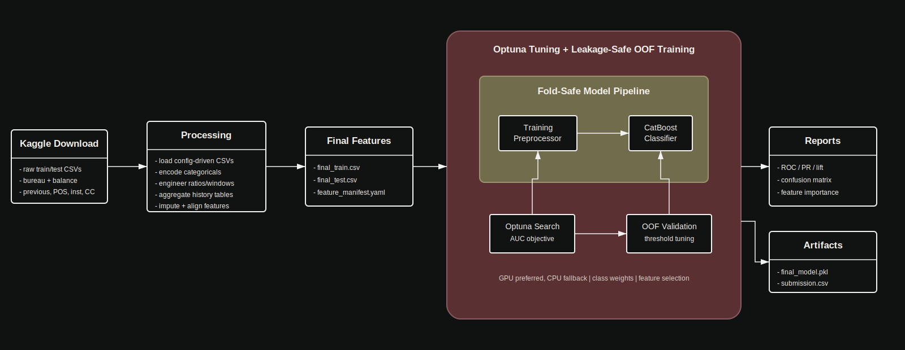
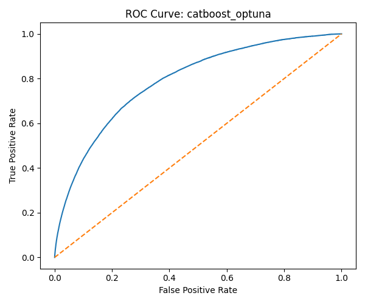
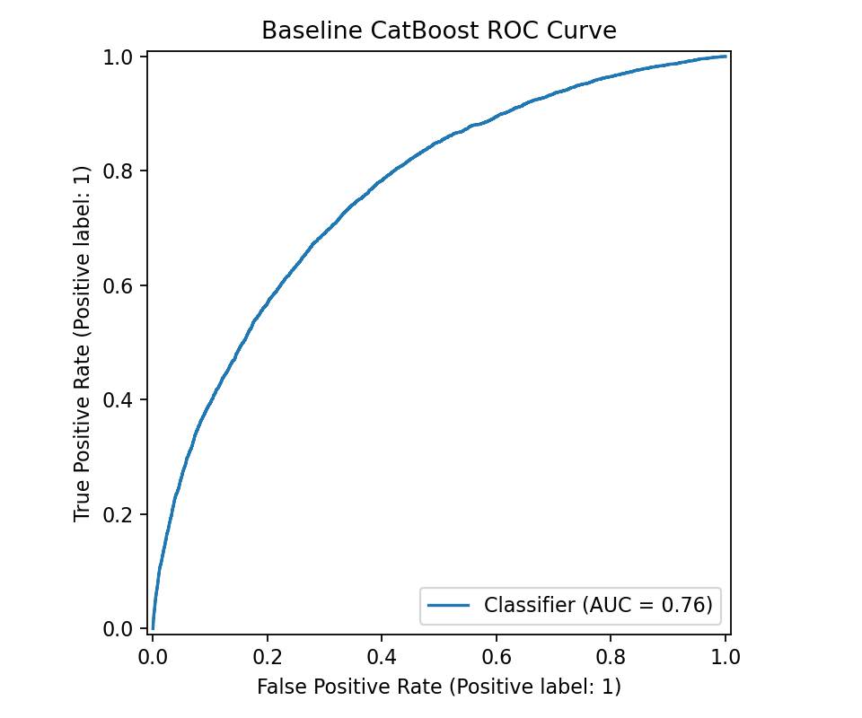
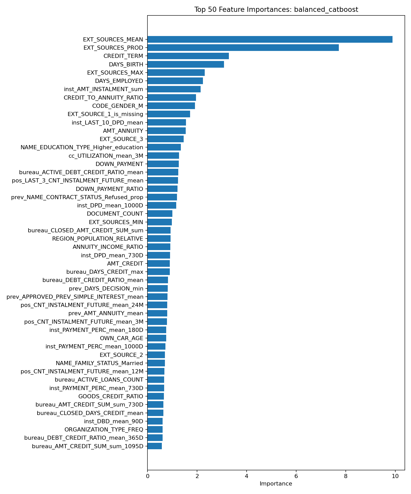
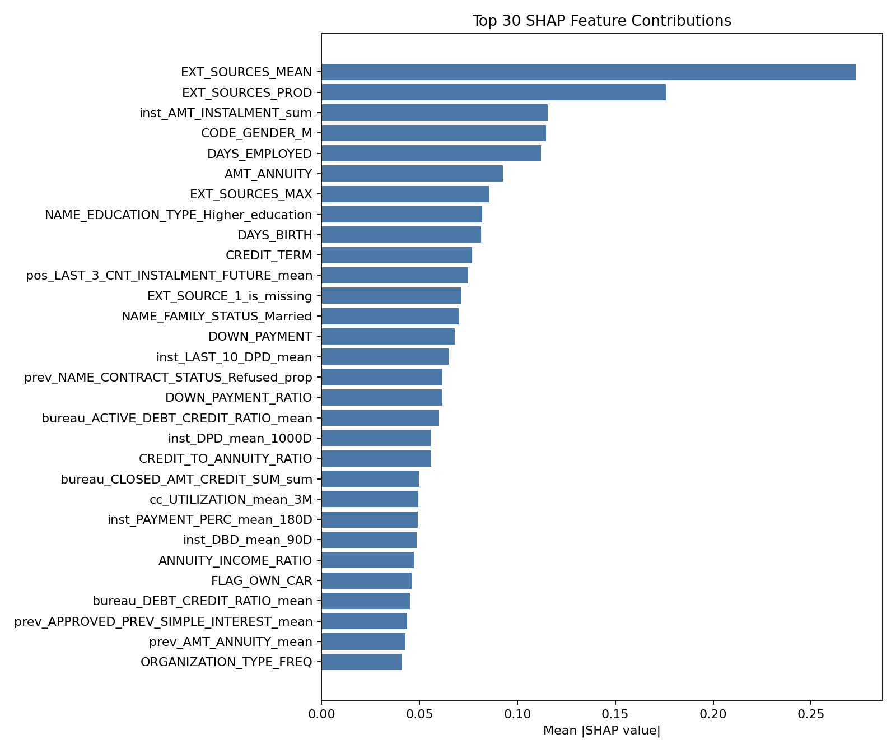
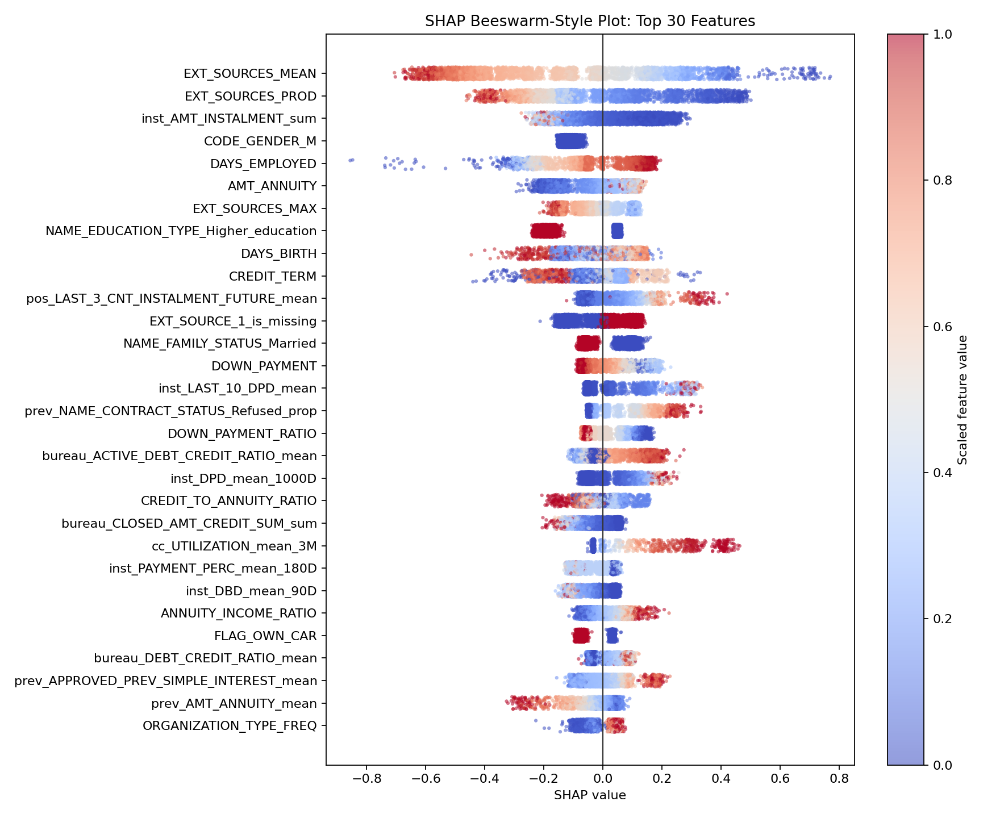

# Home Credit Default Risk ML

Leakage-safe machine-learning pipeline for the Kaggle [**Home Credit Default Risk**](https://www.kaggle.com/c/home-credit-default-risk)
competition. The project builds customer-level features from the raw Home Credit
tables, trains one configured primary model, evaluates it with out-of-fold
validation and produces a submission csv.

Best project result: **0.79074 public leaderboard ROC AUC** from
`Models/20260420_174015_balanced_catboost`.

## Project Pipeline



## Model Visuals

### ROC Curve Comparison

| Best Balanced CatBoost | Vanilla Baseline CatBoost |
| --- | --- |
|  |  |

### Classification Report Comparison

| Best Balanced CatBoost | Vanilla Baseline CatBoost |
| --- | --- |
| <pre>precision    recall  f1-score   support<br><br>0     0.9480    0.9009    0.9239    282686<br>1     0.2795    0.4377    0.3412     24825<br><br>accuracy                         0.8635    307511<br>macro avg     0.6138    0.6693    0.6325    307511<br>weighted avg  0.8941    0.8635    0.8768    307511</pre> | <pre>precision    recall  f1-score   support<br><br>0       0.96      0.72      0.82     56538<br>1       0.17      0.67      0.28      4965<br><br>accuracy                           0.72     61503<br>macro avg       0.57      0.70      0.55     61503<br>weighted avg    0.90      0.72      0.78     61503</pre> |

### Feature Importance



### SHAP Analysis

| Mean Absolute SHAP Contributions | SHAP Beeswarm-Style View |
| --- | --- |
|  |  |

## What This Project Does

The pipeline has two main stages:

1. **Processing**
   - Reads the Kaggle raw CSV tables from `Data/Raw/`.
   - Builds application, bureau, previous application, POS cash, installment,
     and credit-card features.
   - Adds ratio features, recency-window features, last-N history features,
     missing-value indicators, and categorical encodings.
   - Aligns train/test columns and saves final modeling files under `Data/final/`.

2. **Training**
   - Resolves the selected run profile from `conf/config.yaml`.
   - Tunes the primary model with Optuna.
   - Runs out-of-fold validation when the selected profile enables it.
   - Tunes the classification threshold from OOF/search-CV predictions.
   - Fits the final model on all training rows.
   - Saves metrics, plots, feature importance, model artifacts, and submission
     under `Models/<experiment_id>/`.

The default model is single-model **CatBoost**. LightGBM and XGBoost remain
available as configured candidates, but no ensemble path is used.

## Setup

This project uses Python `3.13` and `uv`.

```powershell
uv sync
```

Run commands with the project virtual environment:

```powershell
.\.venv\Scripts\python.exe main.py --help
```

Main dependencies are declared in `pyproject.toml` and pinned in `uv.lock`.
They include Polars, pandas, scikit-learn, imbalanced-learn, CatBoost, LightGBM,
XGBoost, Optuna, matplotlib, seaborn, Hydra, PyYAML, and joblib.

## Data Layout

Place the Kaggle raw files here:

```text
Data/Raw/application_train.csv
Data/Raw/application_test.csv
Data/Raw/bureau.csv
Data/Raw/bureau_balance.csv
Data/Raw/previous_application.csv
Data/Raw/POS_CASH_balance.csv
Data/Raw/installments_payments.csv
Data/Raw/credit_card_balance.csv
```

`Data/` is ignored by git because it contains large raw and generated files.

## How To Run

Process raw data:

```powershell
.\.venv\Scripts\python.exe main.py run.step=process
```

Train model and generate submission:

```powershell
.\.venv\Scripts\python.exe main.py run.step=train
```

Run both stages:

```powershell
.\.venv\Scripts\python.exe main.py run.step=all
```

Override config values from the command line:

```powershell
.\.venv\Scripts\python.exe main.py run.step=train training.run_mode=fast_dev
```

Legacy flags remain supported:

```powershell
.\.venv\Scripts\python.exe main.py --process
.\.venv\Scripts\python.exe main.py --train
.\.venv\Scripts\python.exe main.py --all --config conf/config.yaml
```

Important: if you change preprocessing options in `conf/config.yaml`, run
`run.step=process` before `run.step=train`. Running only training will reuse whatever
already exists in `Data/final/`.

## Inference

Use the saved best model to score already processed pipeline features:

```powershell
.\.venv\Scripts\python.exe src\inference.py --input Data\final\final_test.csv
```

By default, the script loads the experiment configured at
`artifacts.best_experiment_dir`, applies the saved `training_preprocessor.pkl`,
and writes predictions under that experiment folder using
`inference.output_path`.

Custom output path:

```powershell
.\.venv\Scripts\python.exe src\inference.py --input Data\final\final_test.csv --output inference\predictions.csv
```

The inference input must use the processed feature schema, like
`Data/final/final_test.csv`. Raw application rows alone are not enough because
the trained model uses engineered bureau, previous-application, POS,
installment, and credit-card aggregate features.

## Run Profiles

Set `training.run_mode` in `conf/config.yaml`, or override it from the CLI.

| Profile | Purpose | CV Splits | Optuna Trials | Search Data | Full OOF |
| --- | --- | ---: | ---: | ---: | --- |
| `fast_dev` | Quick smoke/debug run | 2 | 5 | 15% | No |
| `balanced` | Practical speed/quality run | 3 | 10 | 35% | Yes |
| `balanced_deep` | Deeper search without full max cost | 3 | 30 | 50% | Yes |
| `max_quality` | Final scoring run | 5 | 50 | 100% | Yes |

The current config default is:

```yaml
training:
  run_mode: "max_quality"
  models:
    primary: "catboost"
```

`max_quality` is slow because it uses all training rows for search and 5-fold
OOF validation. Use `fast_dev` for quick checks.

## Outputs

Processing writes:

```text
Data/final/final_train.csv
Data/final/final_test.csv
Data/final/feature_manifest.yaml
```

Training writes one experiment folder directly under `Models/`:

```text
Models/<experiment_id>/
Models/latest_experiment.txt
```

Common experiment artifacts:

```text
config_snapshot.yaml
training_run_metadata.yaml
best_params.yaml
training_preprocessor.pkl
final_model.pkl
threshold.yaml
submission.csv
reports/evaluation_report.txt
reports/metrics.yaml
reports/oof_predictions.csv
reports/threshold_table.csv
reports/lift_deciles.csv
reports/feature_importance.csv
plots/confusion_matrix.png
plots/roc_curve.png
plots/pr_curve.png
plots/lift_chart.png
plots/feature_importance_top.png
```

`Models/` is ignored by git because it contains generated models and reports.

## Configuration Guide

Most project behavior is controlled from `conf/config.yaml`.

- `run.step`: stage selector; one of `process`, `train`, or `all`.
- `globals`: random seed, global epsilon for safe division, and job count.
- `data.csv`: CSV parser options, null tokens, and schema overrides.
- `data.raw`: raw Kaggle input file paths.
- `data.final`: processed train/test/manifest output paths.
- `artifacts`: shared paths for stable saved artifacts such as the best
  experiment folder.
- `pipeline`: preprocessing thresholds, fill values, categorical encoding,
  anomaly cleanup, feature-engineering sets, aggregation specs, recency windows,
  and last-N windows.
- `inference`: inference input/output defaults, prediction column names,
  threshold source, and missing-feature handling.
- `training.run_profiles`: runtime/quality profiles.
- `training.phases`: explicit `search`, `validate`, and `final_fit` switches.
- `training.experiment`: experiment folder naming.
- `training.threshold_tuning`: OOF/search-CV threshold tuning.
- `training.acceleration`: GPU preference and CPU fallback.
- `training.preprocessing`: scaling, imbalance strategy, feature selection,
  and optional feature pruning.
- `training.models`: primary model, candidate model params, and Optuna search
  spaces.

## ML Logic Notes

- **OOF validation** means each train row is predicted by a model that did not
  train on that row.
- **Kaggle submission** uses raw probabilities, not thresholded labels.
- **Threshold tuning** is for reports/business classification metrics only.
- **GPU handling** tries the configured accelerator first and falls back to CPU
  for retryable GPU capability failures.
- **Artifact guards** save config/data hashes in metadata so stale artifact reuse
  can be detected.

## Null Handling

- CSV tokens such as `""`, `NA`, `NaN`, `nan`, and `NULL` are read as null.
- Important nullable application fields get `<column>_is_missing` indicators.
- Joined auxiliary-table nulls are filled with `pipeline.fill_values.aux_missing`
  because they usually mean "no related history row".
- Base numeric nulls are filled with train medians, and corresponding missing
  indicators are added when the train column had nulls.
- Categorical nulls become the configured `__NULL__` category for one-hot
  encoding.
- Generated ratio infinities/NaNs are converted to null and then filled with
  `pipeline.fill_values.generated_missing`.
- Final validation fails if train or test still contains nulls.

## File-By-File Map

### `.gitignore`

Ignores Python caches, virtual environments, generated data/model folders,
notebooks, CatBoost side-output, local environment files, and common build/test
artifacts.

### `.python-version`

Pins the intended Python version to `3.13`.

### `LICENSE`

MIT license for the project.

### `pyproject.toml`

Defines the package metadata and Python dependencies.

### `uv.lock`

Lockfile generated by `uv`; keeps dependency resolution reproducible.

### `conf/config.yaml`

Single source of truth for paths, features, preprocessing behavior, model
selection, Optuna search spaces, run profiles, artifact names, diagnostics, and
training behavior.

Root `config.yaml` is kept as a compatibility copy for tools and legacy
commands that still point at the old path.

### `main.py`

CLI entrypoint.

- `main`: composes Hydra config, translates legacy `--process`, `--train`,
  `--all`, and `--config` flags, converts config to a plain dict, then calls
  the processing and/or training pipeline.

### Source Layout

Source code is grouped by functional area so pipeline changes stay localized.

```text
src/
  common/           shared artifact, config, and schema helpers
  data_processing/  raw CSV loading, encoding, aggregations, feature cleanup
  model_training/   training config, artifacts, preprocessing, models, search, evaluation
  inference/        reusable batch scoring core and CLI parser
  analysis/         SHAP analysis workflow
```

### `src/data_processing/`

Builds final train/test feature matrices.

- `run_pipeline.py`: orchestration only; loads raw tables, runs feature stages, writes final CSVs.
- `io.py`: Polars CSV options, raw table loading, manifest writing, stale-submission lookup.
- `encoding.py`: categorical and frequency encoding.
- `aggregations.py`: bureau, previous-application, POS, installments, and credit-card aggregations.
- `features.py`: base preprocessing, merges, missing-value handling, global features, cleanup, validation.

### `src/model_training/`

Tunes, validates, fits, reports, and submits the configured model.

- `run_training.py`: orchestration and compatibility re-exports for existing imports/artifacts.
- `config.py`: run-profile resolution and estimator config lookup.
- `artifacts.py`: experiment folders, config snapshots, hashes, metadata, stale-artifact guards.
- `preprocessing.py`: `TrainingPreprocessor`, scaling, feature selection, optional pruning.
- `models.py`: model registry, imbalance handling, accelerator fallback, model fitting.
- `search.py`: Optuna parameter search, CV predictions, final model fit.
- `evaluation.py`: metrics, threshold tuning, lift table, reports, plots, feature importance.

### `src/inference/` And `src/inference.py`

Scores processed feature rows using saved experiment artifacts.

- `src/inference/core.py`: feature alignment, threshold loading, artifact loading, prediction output creation.
- `src/inference/cli.py`: CLI argument parsing and command entrypoint.
- `src/inference.py`: compatibility wrapper so `python src/inference.py ...` still works.

### `src/analysis/` And `src/shap_analysis.py`

Runs SHAP analysis for trained CatBoost experiments.

- `src/analysis/shap.py`: sample loading, SHAP computation, plots, metadata, reports.
- `src/shap_analysis.py`: compatibility wrapper so `python src/shap_analysis.py ...` still works.

## Final Submission Notes

The submission file is:

```text
Models/<experiment_id>/submission.csv
```

It contains:

```text
SK_ID_CURR,TARGET
```

`TARGET` is a probability, not a hard 0/1 label. This is for Kaggle ROC
AUC scoring.
